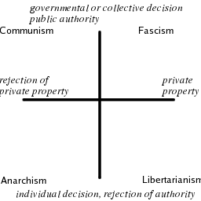
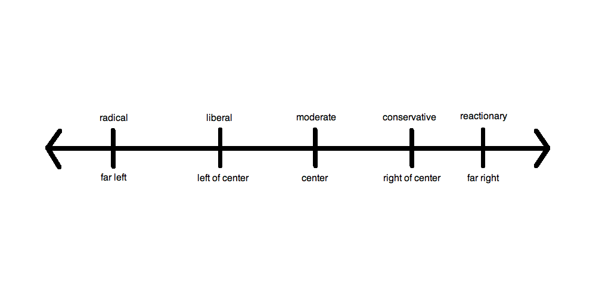

# Ideology detection

## Abstract


Most of the person has a political bias. Often their sentences too. What if we don't know the political bias of the person writing or talking? For my capstone project at General Assembly, I proposed a based multi-view model to evaluate sentences with political meaning.

## Introduction

Everyone has always referred to this project as a political project. But for me, it's mainly a philosophical project. In fact, it is a problem on the true meaning of a writing and on the intrinsic meaning of Truth.
Truth has always been an important topic in human history, in any aspect of knowledge. From Math to Literature, from physics to Art. In language and in political language, probably even more. 

Already 2400 years ago, in Athens, rhetoric started to be an important aspect of political life in the Polis. Socrates, one of the most important philosopher from ancient Greek, had a very harsh debate with the sophists. He described them as Prostitutes of the language. He, in fact, accused them to manipulate people thanks to their debating and dialectic skills. In politics, language is crucial.

Propaganda has been the capstone of totalitarian regimes, but it has been fundamental also in democracy during the cold war. We saw how Political communications changed. Before politicians used to make speeches in the streets. Then a shorter speech or debate on TV. Nowadays they talk with tweets or posts in social media. Shorter and shorter.

Recently everyone saw what probably will be the future of political campaign with the Cambridge Analytica scandal. They used AI to create a bespoke campaign based on a psychological profile created from social media data.

## Description

**The aim** of the project is to detect the ideology of a sentence, using quotes from people with a well known political bias. Trying to capture keys-term that could describe an idea, I want to create a machine to detect the ideology hidden behind social media posts (Twitter, Facebook or Instagram).


#### The Data | ideologies

According to Wikipedia, we have almost 20 different macro-ideology (https://en.wikipedia.org/wiki/List_of_political_ideologies). The most common way to visualize the political spectrum is a 2-D dimension graph.


 

The Left-Right spectrum on the x-axis, and the Freedom-Authority on the y-axis. For this project we choose to identify only the Left-Right (x-axis). So the bias of every person will be projected on the x-axis, in only 1-D.




#### The Data | Biased People and Criteria

Since there is no such Database, I created my own one. The main problem to create a Database with quotes and ideology is my personal Bias. Si I chose some **Criteria** to keep the objectivity:

- Not politician, or not mainly a politician: Since our project is to detect an ideology, politician sometimes diverts from ideology. Popular consent, specific topic and a particular moment of the political scene could push the politician to take different positions.

- English language native, or english main language spoken.

- Personal selection: The first selection comes from my research.

- Objective confirmation - Wikipedia: Every name found in my research has been confirmed by Wikipedia. Wikipedia labeled the political Bias of many public figures. Most of the time it is possible to find it in the "summary-introduction", sometimes in the paragraph "Political views".

- Objective confirmation - allsides.com (https://www.allsides.com/): An alternative way to labeled people is the website allsides.com. This website labeled the political bias of American media and journalist.

- Rejection without confirmation: Without the objective confirmation from one of those websites, the person is rejected and he will not be part of the database.

- The quotes are from 1960 - present.

#### The Data | Source

I took the quotes from 3 main sources: Goodreads, Wikiquote and Brainquote.
- Goodreads: I used a webapp built using the API of the website (https://goodquotesapi.herokuapp.com) and Beautiful Soup
- Wikiquote: There is a python library: wikiquotes (https://pypi.org/project/wikiquotes/)
- Brainquote: Scraping with Beautiful Soup

#### The Data | Ideologies and Authors

**0 | Left (Comunism, Socialism, left Anarchism, new Ambientalism, left Populism)**

Noam Chomsky, Yanis Varoufakis, Jeremy Rifkin, Naomi Klein, John Bellamy Foster, Raj Patel, Michael Parenti, Michael Hardt and Antonio Negri, George Monbiot, John Gray, Michel Chossudovsky, Perry Anderson, Alexander Cockburn, Terry Eagleton, David Harvey, Fredric Jameson, Raymond Williams, E. P. Thompson, Eric Hobsbawm, Tariq Ali, Angela Davis, Mumia Abu-Jamal, Howard Zinn, Judith Butler, John Holloway, Michael Moore, Michael Kazin, Richard D. Wolff, Steve Ellner, Branko Milanovic, Anthony Barnett, Micheal Otsuka, Jodi Dean, Abby Martin.

**1 | Progressive (Social democratic, democratic)**

Juan Williams, Bill Moyers, Paul Krugman, Joseph E. Stiglitz, Jesse Jackson, George Soros, Donna Brazile, James Carville, Tony Judt, Jane Jacobs, Lawrence Lessig, Glenn Greenwald, Al Gore, Alan Bennett, Anthony Giddens, Benjamin Barber, Robert Reich, Simon McKay, Ezra Klein, Nicholas Kristof, Sam Harris, Polly Toynbee.

**2 | Moderate (Indipendent, Popularism, Christian democracy)**

Robert Kagan, Leon Kass, Jonathan Haidt, Ian Bremmer, Thomas Friedman, Peter Drucker, David Brooks, John Avlon, Mark Satin, Arianna Huffington, Ben Bernanke, Joseph Nye, Stephen Walt, Fareed Zakaria, Tibor R Machan, Chris Matthews, David Rockefeller, Peter Thiel, Josh Marshall, Jeffrey D. Sachs, John Rawls, Edward Snowden, Erik Wemple, Maureen Dowd, Lawrence H Summers.

**3 | Conservative(Conservative, Conservative Populism)**

William F. Buckley Jr.,George Will, Bill O'Reilly, Barry Goldwater,Andrew Sullivan, Robert P George, Roger Stone,Paul Manafort, Milton Friedman,Thomas Sowell,Charles Murray, Kevin D Williamson,Walter E Williams, Robert Lucas Jr,Andrew Breitbart, Bill Kristol,David Friedman, William Happer, Ben Stein, Glenn Beck,Mona Charen,David Frum, David Horowitz, Jeane Kirkpatrick,Charles Krauthammer, Irving Kristol, W. Cleon Skousen,Rush Limbaugh,Tucker Carlson,Andrew Napolitano,Roger Kimball,Michelle Mallon,David Clarke.

**4 | Right(Fascism, Alt-Right, right Populism)**

David Goodhart, Ben Shapiro, Jared Taylor, David Duke, Matthew Goodwin, Eric Kaufmann, Richard Bertrand, Augustus Sol Invictus, Peter Hitchens, David Irving, Jason Kessler, Sebastian Gorka, Tomislav Sunić, Paul Weyrich, Pat Buchanan, Steve Bannon, Ann Coulter, Milo Yiannopoulos, Vox Day, Steve Sailer, Stefan Molyneux, Alex Jones, John Derbyshire, Mike Cernovich, Peter Brimelow, Katie Hopkins, Laura Loomer, Paul Joseph, Arthur Kemp, Tommy Robinson, Raheem Kassam, Jerome Corsi, Daniel Drezner, Lou Dobbs, Pamela Geller, Robert Spencer, Karl Hess, Hans-Hermann Hoppe, William Luther Pierce, Joel Pollak, Matt Drudge, Nicholas Wade, John R. Bolton, Dinesh D'Souza, Charlie Kirk.

---------------------------------------------------------------------------------------------------------------------

NB: Many of the people from the lists are not in the Database. The names come from my research following the criteria. I made the list before I took the data and it supposed to provide also for Twitter Database, which I couldn't persuade until the end, for this project. It will be probably part of future implementations. 

#### The Data | Dictionary

- Author
- Quote
- Political Orientation | Target

#### The Data | Train - Validation - Test

The evaluation has 2 steps. The first one comes from a standard random train/test split. The second one is a made from a small Dataset create which roughly 100 quotes from each category. These 100 quotes come from 4 authors that have not been used for training.

## Code on Jupyter Notebook

### Creting and importing the Dataset

Get the quotes, scrapes the quotes, dealing with different names for the same person, dealing with duplicates and quote in the quote.

- [Left scraping / cleaning](DataBase/1_Left/goodreads/quotes_left.ipynb#Left-Scraping-and-cleaning)

- [Centre Left scraping / cleaning](DataBase/2_Centre_Left/goodreads/quotes_centre_left.ipynb#Centre-Left-Scraping-and-cleaning)

- [Centre scraping / cleaning](DataBase/3_Centre/goodreads/quotes_centre.ipynb#Centre-Scraping-and-cleaning)

- [Centre Right scraping / cleaning](DataBase/4_Centre_Right/goodreads/quotes_centre_right.ipynb#Centre-Right-Scraping-and-cleaning)

- [Right scraping / cleaning](DataBase/5_Right/goodreads/quotes_right.ipynb#Right-Scraping-and-cleaning)

- [Importing Option and Dataset](Ideology.ipynb#importing)

### EDA | Baseline

- [EDA|Preprocessing|Lemmatization](Ideology.ipynb#EDA-Preprocessing-Lemmatization)

- [Baseline|Classes](Ideology.ipynb#Baseline-Classes)

### Vocabulary

- [Vocabulary](Ideology.ipynb#Vocabulary)
- [Most frequents words](Ideology.ipynb#top-30-words)


### Modelling

- [CountVectorizer | LogisticRegression-MultinomialNB](Ideology.ipynb#count-vectorizer)
- [Tf-idf | LogisticRegression-MultinomialNB](Ideology.ipynb#tf-idf-vectorizer)


### Voting

- [Voting Classifier](Ideology.ipynb#voting)


### Attempts with different technique

- [Vader and Sentiment Analysis](Ideology.ipynb#vader)
- [Word2Vec](Ideology.ipynb#word2vec)

## Summary and Conclusion

- [Walkthrough the project](Walkthrough.ipynb)
- [Future implementations and Conclusions](Conclusions.ipynb)
- [Slide for the presentation](Presentation.pdf)


```python

```
